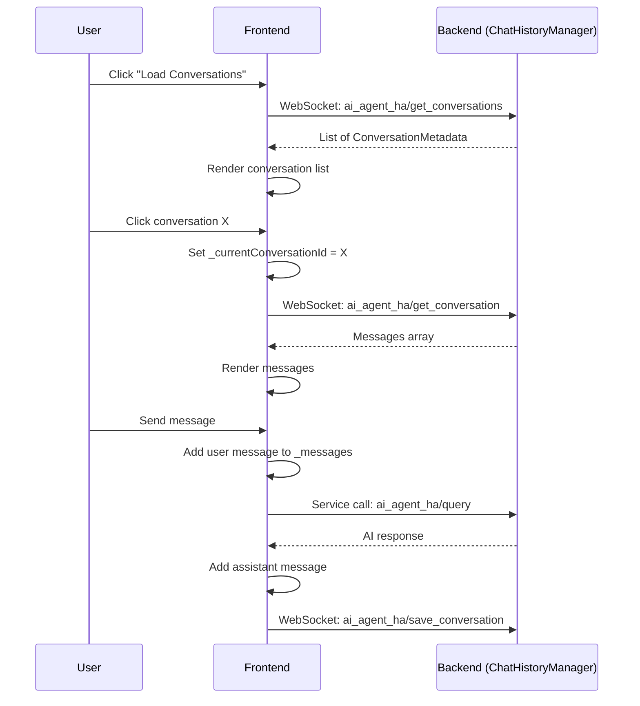

# Multi-Conversation Management UI (A1) - Implementation Plan

## Overview

This plan enhances the existing frontend to support seamless switching between multiple conversations with visual indicators for active conversation, unread messages, and pinned items. The backend `ChatHistoryManager` already supports all required operations (listing, saving, loading, deleting, pinning, tagging, search). The focus is on **UI/UX enhancements** to the frontend panel.

## Current State Analysis

### Already Implemented (Backend)
- [`ChatHistoryManager`](custom_components/ai_agent_ha/chat_history.py:137) with full CRUD operations
- WebSocket commands: `ai_agent_ha/get_conversations`, `ai_agent_ha/save_conversation`, `ai_agent_ha/get_conversation`, `ai_agent_ha/delete_conversation`, `ai_agent_ha/rename_conversation`, `ai_agent_ha/export_conversation`, `ai_agent_ha/pin_conversation`, `ai_agent_ha/add_tag`
- `ConversationMetadata` dataclass with: `conversation_id`, `name`, `created_at`, `updated_at`, `message_count`, `preview`, `tags`, `is_pinned`

### Already Implemented (Frontend)
- State properties: `_conversations`, `_currentConversationId`, `_showHistorySidebar`, `_conversationSearchQuery`, `_contextMenu`
- Methods: `_loadConversations()`, `_saveCurrentConversation()`, `_loadConversation()`, `_createNewConversation()`, `_deleteConversation()`, `_renameConversation()`, `_exportConversation()`, `_pinConversation()`, `_addTagToConversation()`, `_filteredConversations`
- Basic history sidebar toggle via `_toggleHistorySidebar()`

### What's Missing (Implementation Target)
1. **Visual conversation list** in sidebar with proper rendering
2. **Active conversation highlighting** with visual indicator
3. **Unread message indicators** for background conversations
4. **Search UI** with search input field
5. **Pinned conversations section** (separate group at top)
6. **Tag display and management** in conversation list items
7. **Context menu enhancements** (rename inline, delete confirmation)
8. **Conversation tabs** for quick switching (mobile-friendly)
9. **Real-time updates** for background conversations
10. **Empty state handling** for no conversations

## Architecture

### Component Structure

```
AiAgentHaPanel
├── Header (existing)
│   ├── Provider selector (existing)
│   ├── New Conversation button (NEW)
│   └── Clear Chat button (existing)
├── Conversation Tabs (NEW - horizontal scrollable bar)
│   ├── Active tab indicator
│   └── Tab close buttons
├── Main Content Area
│   ├── History Sidebar (enhanced existing)
│   │   ├── Search input (NEW)
│   │   ├── Pinned section (NEW)
│   │   ├── Recent conversations (existing list items)
│   │   └── All conversations (existing list items)
│   └── Chat Messages (existing)
└── Input Area (existing)
```

### Data Flow



## Implementation Tasks

### Phase 1: Core UI Elements (Priority: High)

#### Task 1.1: Enhanced History Sidebar
**File:** `custom_components/ai_agent_ha/frontend/ai_agent_ha-panel.js`

**Changes:**
1. Add search input field at top of sidebar
2. Separate pinned conversations section from recent conversations
3. Render conversation list items with:
   - Conversation name (truncated)
   - Preview text (last message)
   - Timestamp (relative: "2 hours ago")
   - Tag badges (up to 3 visible)
   - Pin icon for pinned conversations
   - Active state highlight
   - Message count badge

**CSS additions:**
```css
.sidebar {
  width: 320px;
  border-right: 1px solid var(--divider-color);
  background: var(--secondary-background-color);
  overflow-y: auto;
}

.sidebar-search {
  padding: 12px;
  border-bottom: 1px solid var(--divider-color);
}

.conversation-list {
  list-style: none;
  padding: 0;
  margin: 0;
}

.conversation-item {
  padding: 12px;
  cursor: pointer;
  border-bottom: 1px solid var(--divider-color);
  transition: background-color 0.2s;
}

.conversation-item:hover {
  background: var(--primary-color);
  opacity: 0.1;
}

.conversation-item.active {
  background: var(--primary-color);
  opacity: 0.2;
  border-left: 3px solid var(--primary-color);
}

.pinned-section {
  border-bottom: 2px solid var(--divider-color);
  margin-bottom: 8px;
}

.pinned-label {
  font-size: 11px;
  text-transform: uppercase;
  color: var(--secondary-text-color);
  padding: 8px 12px;
  font-weight: 600;
}

.conversation-name {
  font-weight: 500;
  white-space: nowrap;
  overflow: hidden;
  text-overflow: ellipsis;
}

.conversation-preview {
  font-size: 12px;
  color: var(--secondary-text-color);
  white-space: nowrap;
  overflow: hidden;
  text-overflow: ellipsis;
  margin-top: 4px;
}

.conversation-meta {
  display: flex;
  align-items: center;
  gap: 8px;
  margin-top: 6px;
  font-size: 11px;
  color: var(--secondary-text-color);
}

.tag-badge {
  background: var(--primary-color);
  color: var(--text-primary-color);
  padding: 2px 6px;
  border-radius: 8px;
  font-size: 10px;
}
```

#### Task 1.2: New Conversation Button
**Changes:**
1. Add "New Conversation" button in header with icon
2. On click: call `_createNewConversation()` and auto-save empty state
3. Add keyboard shortcut: Ctrl+N

#### Task 1.3: Active Conversation Highlighting
**Changes:**
1. Add CSS class `.active` to current conversation in sidebar
2. Visual indicator: left border accent + background highlight
3. Auto-scroll sidebar to active conversation on load

### Phase 2: Advanced Features (Priority: High)

#### Task 2.1: Conversation Search UI
**Changes:**
1. Add search input at top of sidebar
2. Real-time filtering as user types
3. Search scope: name, preview text, tags
4. Clear search button (X icon when text present)

**HTML structure:**
```html
<div class="sidebar-search">
  <ha-textfield
    label="Search conversations"
    .value="${this._conversationSearchQuery}"
    @input="${(e) => this._handleConversationSearch(e.target.value)}"
    outlined
  >
    <ha-icon
      slot="suffix"
      icon="mdi:close"
      style="cursor: pointer; display: ${this._conversationSearchQuery ? 'block' : 'none'}"
      @click="${() => this._handleConversationSearch('')}"
    ></ha-icon>
    <ha-icon slot="prefix" icon="mdi:magnify"></ha-icon>
  </ha-textfield>
</div>
```

#### Task 2.2: Tag Display and Management
**Changes:**
1. Display up to 3 tags as badges in conversation list items
2. Click tag to filter by tag
3. Right-click conversation to add/remove tags via context menu

#### Task 2.3: Context Menu Enhancements
**Changes:**
1. Extend existing `_showContextMenu()` with:
   - Rename (inline edit)
   - Pin/Unpin toggle
   - Add tag
   - Export
   - Delete (with confirmation)
2. Add CSS for context menu positioning

### Phase 3: UX Polish (Priority: Medium)

#### Task 3.1: Conversation Tabs
**Changes:**
1. Add horizontal scrollable tab bar below header
2. Show last 5 accessed conversations
3. Active tab highlighted with bottom border
4. Click tab to switch conversation
5. Close button on each tab (X)
6. Falls back to sidebar-only on narrow screens

**HTML structure:**
```html
<div class="conversation-tabs">
  <div class="tabs-scroll">
    ${this._recentConversations.map(conv => html`
      <div class="tab ${conv.conversation_id === this._currentConversationId ? 'active' : ''}"
           @click="${() => this._loadConversation(conv.conversation_id)}">
        <span class="tab-name">${conv.name}</span>
        <span class="tab-close" @click="${(e) => { e.stopPropagation(); this._closeTab(conv.conversation_id); }}">×</span>
      </div>
    `)}
  </div>
</div>
```

#### Task 3.2: Real-time Updates
**Changes:**
1. Use Home Assistant's state change events to detect conversation updates
2. Auto-refresh sidebar when background conversation is modified
3. Show "unsaved changes" indicator when current conversation has new messages

#### Task 3.3: Empty State Handling
**Changes:**
1. Show helpful message when no conversations exist
2. Include "Start a Conversation" CTA button
3. Show example prompts

```html
<div class="empty-state">
  <ha-icon icon="mdi:chat" style="font-size: 48px; color: var(--secondary-text-color);"></ha-icon>
  <h3>No conversations yet</h3>
  <p>Start a conversation to see it here</p>
  <mwc-button label="Start a Conversation" @click="${() => this.shadowRoot.querySelector('ha-textfield').focus()}"></mwc-button>
</div>
```

#### Task 3.4: Responsive Design
**Changes:**
1. Sidebar collapses to overlay on narrow screens (< 600px)
2. Conversation tabs replace sidebar on medium screens (600-900px)
3. Full sidebar + tabs on wide screens (> 900px)

## WebSocket Commands Reference

| Command Type | Direction | Description |
|-------------|-----------|-------------|
| `ai_agent_ha/get_conversations` | Client → Server | Get all conversations with metadata |
| `ai_agent_ha/get_conversation` | Client → Server | Get messages for a specific conversation |
| `ai_agent_ha/save_conversation` | Client → Server | Save/update a conversation |
| `ai_agent_ha/delete_conversation` | Client → Server | Delete a conversation |
| `ai_agent_ha/rename_conversation` | Client → Server | Rename a conversation |
| `ai_agent_ha/export_conversation` | Client → Server | Export conversation as JSON |
| `ai_agent_ha/pin_conversation` | Client → Server | Toggle pin status |
| `ai_agent_ha/add_tag` | Client → Server | Add a tag to a conversation |

## Frontend State Changes

### New State Properties
```javascript
static get properties() {
  return {
    // ... existing properties ...
    
    // NEW: Recent conversations for tab bar
    _recentConversations: { type: Array, reflect: false, attribute: false },
    
    // NEW: Unread message counts per conversation
    _unreadCounts: { type: Object, reflect: false, attribute: false },
    
    // NEW: Active tag filter
    _activeTagFilter: { type: String, reflect: false, attribute: false },
    
    // NEW: Sidebar collapse state
    _sidebarCollapsed: { type: Boolean, reflect: false, attribute: false },
    
    // NEW: Rename mode state
    _renamingId: { type: String, reflect: false, attribute: false },
    _renameValue: { type: String, reflect: false, attribute: false },
  };
}
```

### New Helper Methods
```javascript
// Get recent conversations for tab bar
get _recentConversations() {
  if (!this._conversations) return [];
  return [...this._conversations]
    .sort((a, b) => new Date(b.updated_at) - new Date(a.updated_at))
    .slice(0, 5);
}

// Format relative time
_formatRelativeTime(isoString) {
  const date = new Date(isoString);
  const now = new Date();
  const diffMs = now - date;
  const diffMins = Math.floor(diffMs / 60000);
  const diffHours = Math.floor(diffMs / 3600000);
  const diffDays = Math.floor(diffMs / 86400000);
  
  if (diffMins < 1) return 'Just now';
  if (diffMins < 60) return `${diffMins}m ago`;
  if (diffHours < 24) return `${diffHours}h ago`;
  if (diffDays < 7) return `${diffDays}d ago`;
  return date.toLocaleDateString();
}

// Get filtered conversations with tag filter
get _filteredConversations() {
  let conversations = this._conversations || [];
  
  // Apply tag filter
  if (this._activeTagFilter) {
    conversations = conversations.filter(c => 
      c.tags?.includes(this._activeTagFilter)
    );
  }
  
  // Apply text search (existing)
  if (this._conversationSearchQuery) {
    const query = this._conversationSearchQuery.toLowerCase();
    conversations = conversations.filter(c =>
      c.name?.toLowerCase().includes(query) ||
      c.preview?.toLowerCase().includes(query) ||
      c.tags?.some(t => t.toLowerCase().includes(query))
    );
  }
  
  return conversations;
}

// Separate pinned and unpinned
get _pinnedConversations() {
  return (this._filteredConversations || []).filter(c => c.is_pinned);
}

get _unpinnedConversations() {
  return (this._filteredConversations || []).filter(c => !c.is_pinned);
}
```

## Files to Modify

| File | Changes |
|------|---------|
| `custom_components/ai_agent_ha/frontend/ai_agent_ha-panel.js` | All UI changes: sidebar, tabs, search, context menu |
| `custom_components/ai_agent_ha/frontend/ai_agent_ha-panel.js` (styles section) | New CSS for sidebar, tabs, conversation items |

## Testing Checklist

- [ ] Load conversations list on panel mount
- [ ] Search filters conversations correctly
- [ ] Click conversation loads messages
- [ ] Active conversation highlighted
- [ ] Pinned conversations appear first
- [ ] Tags display correctly
- [ ] New conversation button works
- [ ] Delete with confirmation works
- [ ] Rename works
- [ ] Pin/unpin toggle works
- [ ] Export downloads JSON file
- [ ] Responsive design on mobile
- [ ] Tabs appear on wide screens
- [ ] Tabs replace sidebar on medium screens
- [ ] Sidebar overlay on narrow screens

## Estimated Complexity

- **Frontend code changes:** ~500 lines of JavaScript, ~300 lines of CSS
- **Backend changes:** None (existing ChatHistoryManager sufficient)
- **Testing effort:** Medium (multiple UI states to verify)

## Implementation Order

1. **Task 1.1:** Enhanced History Sidebar (CSS + rendering)
2. **Task 1.2:** New Conversation Button
3. **Task 1.3:** Active Conversation Highlighting
4. **Task 2.1:** Conversation Search UI
5. **Task 2.2:** Tag Display and Management
6. **Task 2.3:** Context Menu Enhancements
7. **Task 3.1:** Conversation Tabs
8. **Task 3.2:** Real-time Updates
9. **Task 3.3:** Empty State Handling
10. **Task 3.4:** Responsive Design
